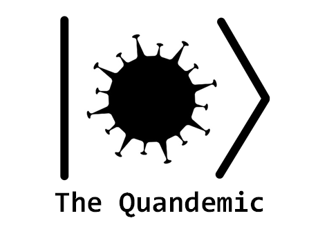

Contributors:
[@JongheumJung](mailto://jungjh0330snu@snu.ac.kr),
[@YoonjaeChung](https://github.com/nature-cyj),
[@GyunghunKim](https://github.com/GyunghunKim) 

## Abstract

In the regime of a global pandemic, leaders around the world need to consider various possibilities
and take conscious actions to protect their citizens from the infectious virus. In the quantum world
that we model in this game, every possible situation exists as a superposed state. Nothing is
decisive at all. You, as the leader of this quantum city, need to suppress the possibility, or
amplitude of states representing bad situations. Lastly, the mandatory PCR test for every citizen is
waiting you---it 'measures' the city and will show whether your policies rescued the city or not.
Predict, act, and measure!

## The Game

### Objectives
- Obtain negative result for everyone at the last PCR test.

### Contents

- **Mode** 
In this game, there are two modes: Pure Quandemic and Mixed Quandemic. From the former one, the state
of the citizens is always pure state. All the actions are unitary. On the other hand, when using 
the latter one, the state of the citizens can be mixed state. Considering a density matrix will be a 
good strategy. Most of actions are unitary, however, swapping two citiznes lead to non-unitary evolution.
More details are described at 'Regular Action: Move Citizens (Swap)'.
-Input : write 1(0) if you want to play 'Mixed Quandemic'('Pure Quandemic'). ex) 1

- **Level** 
The level indicates the initial number of infected people. However, indices of infected people are selected
randomly. 
-Input : write the number of level. ex) 3

- **Citizens** 
A quantum circuit with N by M qubits represents a city that N\*M citizens live with a deadly virus.
0's and 1's appearing on the computational basis of this system corresponds to healthy and infected
states, respectively.  Since the people live in a quantum world, the city stays in a superposition
of possible infection states!

- **Regular Action: PCR Testing (Single Person)** 
A PCR test corresponds to measurement on a specific qubit, or a citizen of this city. Not only
obtains a decisive result about the citizen's infection status, the test destroys possibility of the
city to be in states which counter the test result. In quantum-like words, the measurement projects
previous state into a subspace contains the measured result.
-Input : write the index of person you want to inspect. ex) 4

- **Special Action: PCR Testing (Total Inspection)** 
For sake of the player, one can measure states of all qubits at once for only one time during the
game. It will remove superposition of the city's state, but the state will quickly branch and
involve possibilities as time goes on.
-Input : write 1(0) if you want(do not want) to do the action. ex) 1

- **Regular Action: Move Citizens (Swap)** 
In each turn, player should choose pairs of citizens to swap position. However, when a player use 
'Mixed Quandemic' mode, they might additionally catch the virus since the swapped citizens can be exposed 
to the contaminated environment while swapping each other. The newly possible infected
state is involved to the game as superposition.  Simply, a quantum **SWAP** gate and a Kraus
operator(only for 'Mixed Quandemic' mode) which puts 0 to 1 at a fixed possibility successively applied 
for each pair of citizens that the player selected. Players are allowed to swap 'neighboring' citizens only. 
-Input : write the pairs of people's indices for inspection. If you want to inspect (0,1) and (3,4) --> ex) 0,1 3,4

- **Regular Action: Send Hospital** 
There are two hospitals in this city placed at the certain area. 
  - **The 'H' hospital** 
    The 'H' hospital is placed on boundaries of the city. For example, in 3x3 city, 'H' hospital
    is placed at position 0, 1, 2, 3, 5, 6, 7, 8. The 'H' hospital works by applying Hadamard gate 
    if player selects its position.  Be careful that it might increase probability of infection 
    if it is used in a wrong way!
    
    
  - **The Pauli's X hospital** 
    The Pauli's X hospital is placed at the center of the city. It acts to the citizen at the center
    by applying X gate. So the hospital will cure a citizen if one is infected, but it will infect a
    healthy one at the same time! This hospital has the perfect medicine, but it is located at the 
    center of the city.. It is really easy to get infected via passing through the central city.
    
-Input : write the indices of people who wants to go to the hospital. ex) 0 1 3
    
In each turn, the player should select which citizens to send hospital. It is only possible to send
citizens that are placed on the hostpial area.

- **The last, mandatory PCR test** 
This test decides whether your critical choices during the pandemic were successful or not. This
very final operation measures all qubits of the system as the total survey. Even if a single **1**
exists in your final state, it will move, copy itself and spread throughout your city again. No way!
The game's objective is to obtain the result |00...00> and to free your city from the pandemic
forever! 
-Input : write 1(0) if you want(do not want) to do the action. ex) 1
